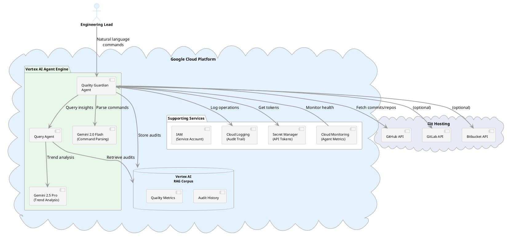

```plantuml
@startuml quality-guardian-deployment
!theme plain
top to bottom direction

skinparam actor {
  BackgroundColor #E3F2FD
  BorderColor #BBDEFB
  FontName Arial
  FontSize 12
  FontStyle bold
}

skinparam cloud {
  BorderColor #999999
  FontName Arial
  FontSize 13
  FontStyle bold
}

skinparam package {
  BorderColor #999999
  FontName Arial
  FontSize 12
  FontStyle bold
}

skinparam component {
  BackgroundColor #F5F5F5
  BorderColor #CCCCCC
  FontName Arial
  FontSize 11
}

skinparam database {
  BackgroundColor #E3F2FD
  BorderColor #999999
  FontName Arial
  FontSize 11
}

skinparam arrow {
  Color #999999
  Thickness 2
}

' Level 1: User & Git Hosting
actor "Engineering Lead" as user
cloud "Git Hosting" as git #E8EAF6 {
  component "GitHub API" as github_api
  component "GitLab API" as gitlab_api
  component "Bitbucket API" as bitbucket_api
}

' Level 2: Google Cloud Platform
cloud "Google Cloud Platform" as gcp #E3F2FD {
  package "Vertex AI Agent Engine" as vertex #E8F5E9 {
    component "Quality Guardian\nAgent" as qg_agent
    component "Query Agent" as query_agent
    component "Gemini 2.0 Flash\n(Command Parsing)" as gemini_flash
    component "Gemini 2.5 Pro\n(Trend Analysis)" as gemini_pro
  }
  
  database "Vertex AI\nRAG Corpus" as rag_corpus {
    component "Audit History" as audit_history
    component "Quality Metrics" as quality_metrics
  }
  
  package "Supporting Services" as services {
    component "Cloud Logging\n(Audit Trail)" as logging
    component "Secret Manager\n(API Tokens)" as secrets
    component "Cloud Monitoring\n(Agent Metrics)" as monitoring
    component "IAM\n(Service Account)" as iam
  }
}

' Connections
user --> qg_agent : Natural language\ncommands
qg_agent --> github_api : Fetch commits/repos
qg_agent --> gitlab_api : (optional)
qg_agent --> bitbucket_api : (optional)
qg_agent --> gemini_flash : Parse commands
qg_agent --> query_agent : Query insights
query_agent --> rag_corpus : Retrieve audits
query_agent --> gemini_pro : Trend analysis
qg_agent --> rag_corpus : Store audits
qg_agent --> logging : Log operations
qg_agent --> secrets : Get tokens
monitoring --> qg_agent : Monitor health

@enduml
```
