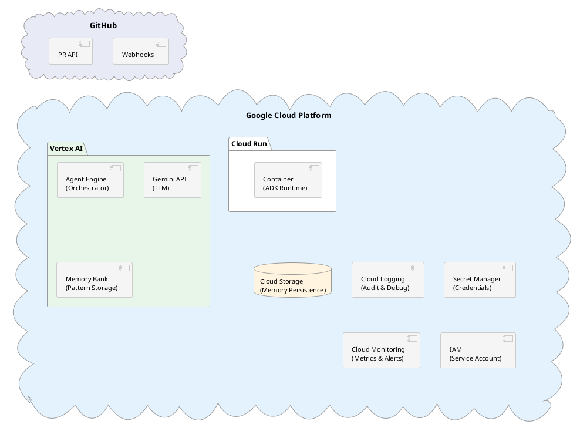

```plantuml
@startuml deployment
!theme plain
top to bottom direction

skinparam actor {
  BackgroundColor #E3F2FD
  BorderColor #BBDEFB
  FontName Arial
  FontSize 12
  FontStyle bold
}

skinparam cloud {
  BorderColor #999999
  FontName Arial
  FontSize 13
  FontStyle bold
}

skinparam package {
  BorderColor #999999
  FontName Arial
  FontSize 12
  FontStyle bold
}

skinparam component {
  BackgroundColor #F5F5F5
  BorderColor #CCCCCC
  FontName Arial
  FontSize 11
}

skinparam database {
  BackgroundColor #FFF4E0
  BorderColor #999999
  FontName Arial
  FontSize 11
}

skinparam arrow {
  Color #999999
  Thickness 2
}

' Level 1: GitHub
cloud "GitHub" as github #E8EAF6 {
  component "Webhooks" as webhooks
  component "PR API" as pr_api
}

' Level 3: Google Cloud Platform
cloud "Google Cloud Platform" as gcp #E3F2FD {
  package "Cloud Run" as cloudrun {
    component "Container\n(ADK Runtime)" as container
  }
  
  package "Vertex AI" as vertex #E8F5E9 {
    component "Agent Engine\n(Orchestrator)" as agent_engine
    component "Gemini API\n(LLM)" as gemini_api
    component "Memory Bank\n(Pattern Storage)" as memory_bank
  }
  
  rectangle components {
    skinparam rectangle{
      FontColor transparent
      BackgroundColor transparent
      BorderColor transparent
      shadowing false
    }

    database "Cloud Storage\n(Memory Persistence)" {
    }
    
    component "Cloud Logging\n(Audit & Debug)" as logging
    
    component "Secret Manager\n(Credentials)" as secrets
    
    component "Cloud Monitoring\n(Metrics & Alerts)" as monitoring
    
    component "IAM\n(Service Account)" as iam
  }
  
cloudrun -[hidden]-> components

}

' Force compact vertical layout
github -[hidden]down-> gcp

@enduml
```
