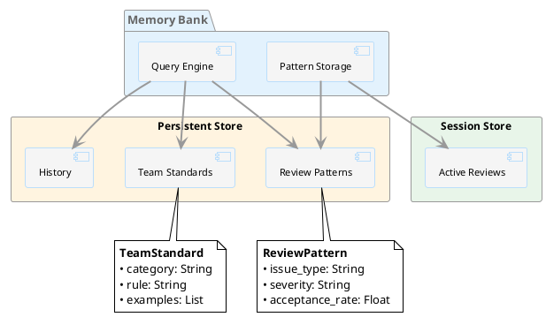

```plantuml
@startuml memory-system
!theme plain
top to bottom direction

skinparam package {
  BackgroundColor #E3F2FD
  BorderColor #999999
  FontName Arial
  FontSize 13
  FontStyle bold
  FontColor #666666
}

skinparam rectangle {
  BorderColor #999999
  FontName Arial
  FontSize 12
}

skinparam component {
  BackgroundColor #F5F5F5
  BorderColor #BBDEFB
  FontName Arial
  FontSize 11
}

skinparam class {
  BackgroundColor #FAFAFA
  BorderColor #CCCCCC
  FontName Arial
  FontSize 11
  AttributeFontSize 10
}

skinparam arrow {
  Color #999999
  Thickness 2
}

package "Memory Bank" {
  component "Query Engine" as query
  component "Pattern Storage" as pattern_storage
}

rectangle "Session Store" #E8F5E9 {
  component "Active Reviews" as active_reviews
}

rectangle "Persistent Store" #FFF4E0 {
  component "Review Patterns" as review_patterns
  component "Team Standards" as team_standards
  component "History" as history
}

note bottom of review_patterns
  **ReviewPattern**
  • issue_type: String
  • severity: String
  • acceptance_rate: Float
end note

note bottom of team_standards
  **TeamStandard**
  • category: String
  • rule: String
  • examples: List
end note

query --> review_patterns
query --> team_standards
query --> history

pattern_storage --> active_reviews
pattern_storage --> review_patterns

@enduml
```
