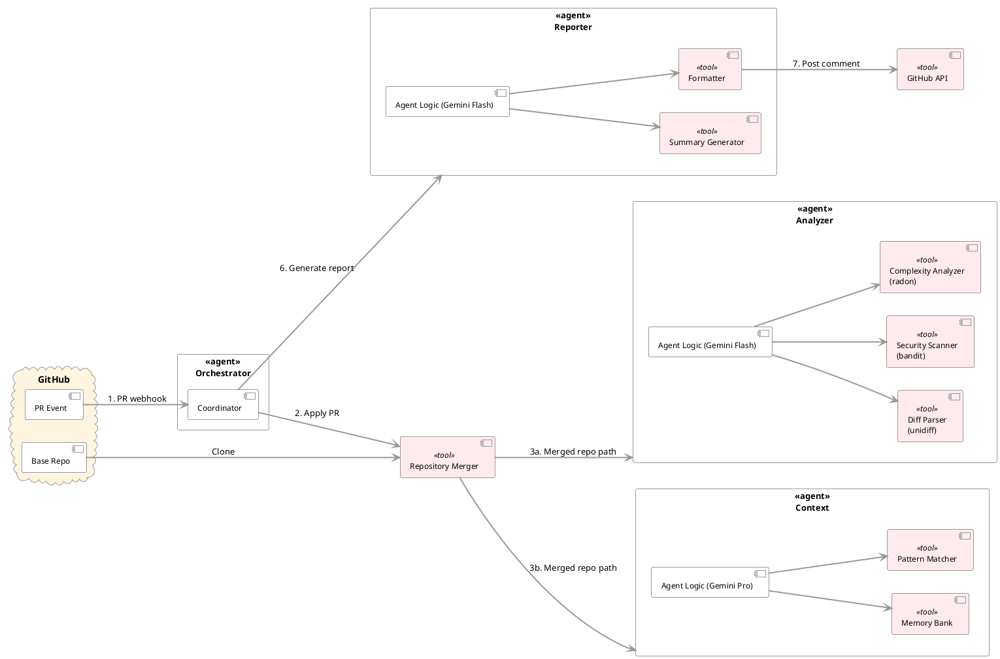

```plantuml
@startuml multi-agent-architecture
!theme plain
left to right direction

skinparam component {
  BackgroundColor<<github>> #FFF4E0
  BackgroundColor<<agent>> #E8F5E9
  BackgroundColor<<tool>> #FFEBEE
  BorderColor #999999
  FontName Arial
  FontSize 12
  ArrowColor #999999
  ArrowThickness 2
}

skinparam cloud {
  BackgroundColor #FFF4E0
  BorderColor #999999
}

skinparam rectangle {
  BorderColor #999999
  FontName Arial
  FontSize 13
  FontStyle bold
}

skinparam database {
  BackgroundColor #FFEBEE
  BorderColor #999999
}

' Level 1: Input
cloud "GitHub" as github {
  component "PR Event" as pr_event
  component "Base Repo" as base_repo
}

' Level 2: Orchestration
rectangle "Orchestrator" as Orchestrator <<agent>> {
  component "Coordinator" as coordinator
}

' Level 2.5: Pre-processing
component "Repository Merger" as repo_merger <<tool>>

pr_event -down-> coordinator : 1. PR webhook
coordinator -down-> repo_merger : 2. Apply PR
base_repo -down-> repo_merger : Clone
repo_merger -down-> Analyzer : 3a. Merged repo path
repo_merger -down-> Context : 3b. Merged repo path

coordinator -down-> Reporter : 6. Generate report

' Level 3: Agent Layer
rectangle "Analyzer" as Analyzer <<agent>> {
  component "Agent Logic (Gemini Flash)" as agent_logic
  component "Diff Parser\n(unidiff)" as diff_parser <<tool>>
  component "Security Scanner\n(bandit)" as security_scanner <<tool>>
  component "Complexity Analyzer\n(radon)" as complexity_analyzer <<tool>>
  
  agent_logic -down-> diff_parser
  agent_logic -down-> security_scanner  
  agent_logic -down-> complexity_analyzer
  
  diff_parser -[hidden]right-> security_scanner
  security_scanner -[hidden]right-> complexity_analyzer
}

rectangle "Context" as Context <<agent>> {
  component "Agent Logic (Gemini Pro)" as context_logic
  component "Memory Bank" as memory_bank <<tool>>
  component "Pattern Matcher" as pattern_matcher <<tool>>
  
  context_logic -down-> memory_bank
  context_logic -down-> pattern_matcher
  
  memory_bank -[hidden]right-> pattern_matcher
}

rectangle "Reporter" as Reporter <<agent>> {
  component "Agent Logic (Gemini Flash)" as reporter_logic
  component "Summary Generator" as summary_gen <<tool>>
  component "Formatter" as formatter <<tool>>
  
  reporter_logic -down-> summary_gen
  reporter_logic -down-> formatter
  
  summary_gen -[hidden]right-> formatter
}

' Level 4: External Tools/APIs
component "GitHub API" as github_api <<tool>>

formatter -down-> github_api : 7. Post comment

@enduml
```
