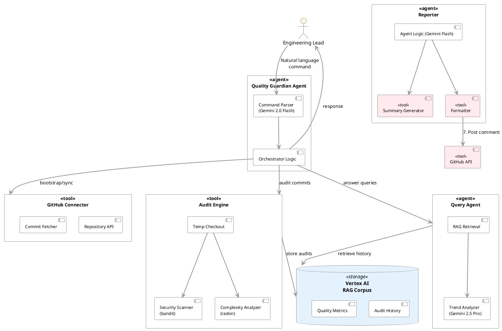

```plantuml
@startuml quality-guardian-architecture
!theme plain
top to bottom direction

skinparam component {
  BackgroundColor<<github>> #FFF4E0
  BackgroundColor<<agent>> #E8F5E9
  BackgroundColor<<tool>> #FFEBEE
  BackgroundColor<<storage>> #E3F2FD
  BorderColor #999999
  FontName Arial
  FontSize 12
  ArrowColor #999999
  ArrowThickness 2
}

skinparam actor {
  BackgroundColor #FFF4E0
  BorderColor #999999
}

skinparam rectangle {
  BorderColor #999999
  FontName Arial
  FontSize 13
  FontStyle bold
}

skinparam database {
  BackgroundColor #E3F2FD
  BorderColor #999999
}

' Level 1: User
actor "Engineering Lead" as user

' Level 2: Core Agent (Orchestrator)
rectangle "Quality Guardian Agent" as QGAgent <<agent>> {
  component "Command Parser\n(Gemini 2.0 Flash)" as parser
  component "Orchestrator Logic" as orchestrator
  
  parser -down-> orchestrator
}

' Level 3: Backend Tools
rectangle "GitHub Connector" as github_connector <<tool>> {
  component "Repository API" as repo_api
  component "Commit Fetcher" as commit_fetcher
}

rectangle "Audit Engine" as audit_engine <<tool>> {
  component "Security Scanner\n(bandit)" as security_scanner
  component "Complexity Analyzer\n(radon)" as complexity_analyzer
  component "Temp Checkout" as temp_checkout
  
  temp_checkout -down-> security_scanner
  temp_checkout -down-> complexity_analyzer
}

rectangle "Query Agent" as query_agent <<agent>> {
  component "RAG Retrieval" as rag_retrieval
  component "Trend Analyzer\n(Gemini 2.5 Pro)" as trend_analyzer
  
  rag_retrieval -down-> trend_analyzer
}

' Level 4: Storage
database "Vertex AI\nRAG Corpus" as rag_storage <<storage>> {
  component "Audit History" as audit_history
  component "Quality Metrics" as quality_metrics
}

' Flows
user -down-> parser : Natural language\ncommand
orchestrator -down-> github_connector : bootstrap/sync
orchestrator -down-> audit_engine : audit commits
orchestrator -down-> query_agent : answer queries
audit_engine -down-> rag_storage : store audits
query_agent -down-> rag_storage : retrieve history
orchestrator -up-> user : response

rectangle "Reporter" as Reporter <<agent>> {
  component "Agent Logic (Gemini Flash)" as reporter_logic
  component "Summary Generator" as summary_gen <<tool>>
  component "Formatter" as formatter <<tool>>
  
  reporter_logic -down-> summary_gen
  reporter_logic -down-> formatter
  
  summary_gen -[hidden]right-> formatter
}

' Level 4: External Tools/APIs
component "GitHub API" as github_api <<tool>>

formatter -down-> github_api : 7. Post comment

@enduml
```
