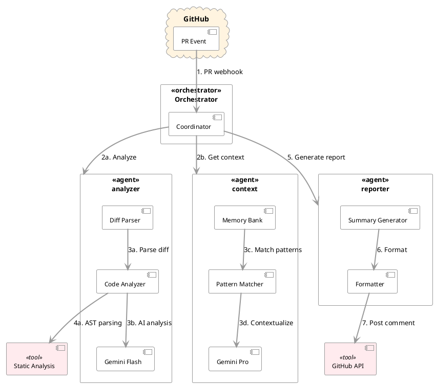

```plantuml
@startuml multi-agent-architecture
!theme plain
top to bottom direction

skinparam component {
  BackgroundColor<<github>> #FFF4E0
  BackgroundColor<<orchestrator>> #E3F2FD
  BackgroundColor<<agent>> #E8F5E9
  BackgroundColor<<tool>> #FFEBEE
  BorderColor #999999
  FontName Arial
  FontSize 12
  ArrowColor #999999
  ArrowThickness 2
}

skinparam cloud {
  BackgroundColor #FFF4E0
  BorderColor #999999
}

skinparam rectangle {
  BorderColor #999999
  FontName Arial
  FontSize 13
  FontStyle bold
}

skinparam database {
  BackgroundColor #FFEBEE
  BorderColor #999999
}

' Level 1: Input
cloud "GitHub" as github {
  component "PR Event" as pr_event
}

' Level 2: Orchestration
rectangle "Orchestrator" as orchestrator <<orchestrator>> {
  component "Coordinator" as coordinator
}

pr_event -down-> coordinator : 1. PR webhook

coordinator -down-> analyzer : 2a. Analyze
coordinator -down-> context : 2b. Get context
coordinator -down-> reporter : 5. Generate report

' Level 3: Agent Layer (left to right: Analyzer, Context, Reporter)
left to right direction

rectangle "Analyzer Agent" as analyzer <<agent>> {
  top to bottom direction
  component "Diff Parser" as diff_parser
  component "Code Analyzer" as code_analyzer
  component "Gemini Flash" as gemini_flash
  
  diff_parser -down-> code_analyzer : 3a. Parse diff
  code_analyzer -down-> gemini_flash : 3b. AI analysis
}

rectangle "Context Agent" as context <<agent>> {
  top to bottom direction
  component "Memory Bank" as memory_bank
  component "Pattern Matcher" as pattern_matcher
  component "Gemini Pro" as gemini_pro
  
  memory_bank -down-> pattern_matcher : 3c. Match patterns
  pattern_matcher -down-> gemini_pro : 3d. Contextualize
}

rectangle "Reporter Agent" as reporter <<agent>> {
  top to bottom direction
  component "Summary Generator" as summary_gen
  component "Formatter" as formatter
  
  summary_gen -down-> formatter : 6. Format
}

analyzer -[hidden]right-> context
context -[hidden]right-> reporter

top to bottom direction

' Level 4: Tools (separate blocks to avoid pull)
component "Static Analysis" as static_analysis <<tool>>
component "GitHub API" as github_api <<tool>>

code_analyzer -down-> static_analysis : 4a. AST parsing
formatter -down-> github_api : 7. Post comment

static_analysis -[hidden]right-> github_api

@enduml
```
