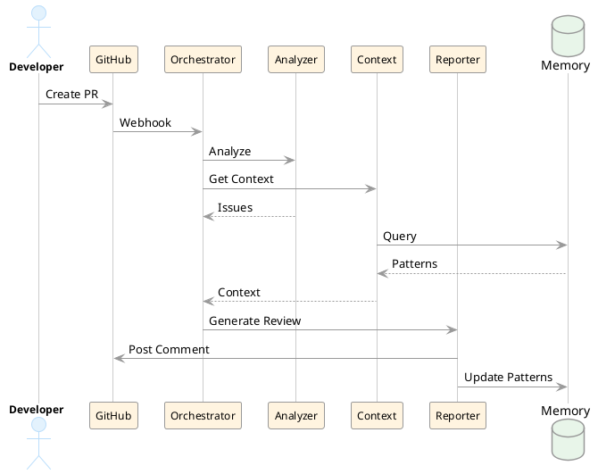

```plantuml
@startuml sequence-flow
!theme plain

skinparam sequence {
  ArrowColor #999999
  ActorBorderColor #BBDEFB
  ActorBackgroundColor #E3F2FD
  ActorFontName Arial
  ActorFontSize 12
  ActorFontStyle bold
  
  ParticipantBorderColor #999999
  ParticipantBackgroundColor #FFF4E0
  ParticipantFontName Arial
  ParticipantFontSize 12
  
  LifeLineBorderColor #CCCCCC
  LifeLineBackgroundColor #F5F5F5
  
  BoxBorderColor #999999
  BoxBackgroundColor #FAFAFA
}

skinparam database {
  BackgroundColor #E8F5E9
  BorderColor #999999
}

actor Developer as dev
participant "GitHub" as gh
participant "Orchestrator" as orch
participant "Analyzer" as ana
participant "Context" as ctx
participant "Reporter" as rep
database "Memory" as mem

dev -> gh : Create PR
gh -> orch : Webhook

orch -> ana : Analyze
orch -> ctx : Get Context

ana --> orch : Issues
ctx -> mem : Query
mem --> ctx : Patterns
ctx --> orch : Context

orch -> rep : Generate Review
rep -> gh : Post Comment
rep -> mem : Update Patterns

@enduml
```
