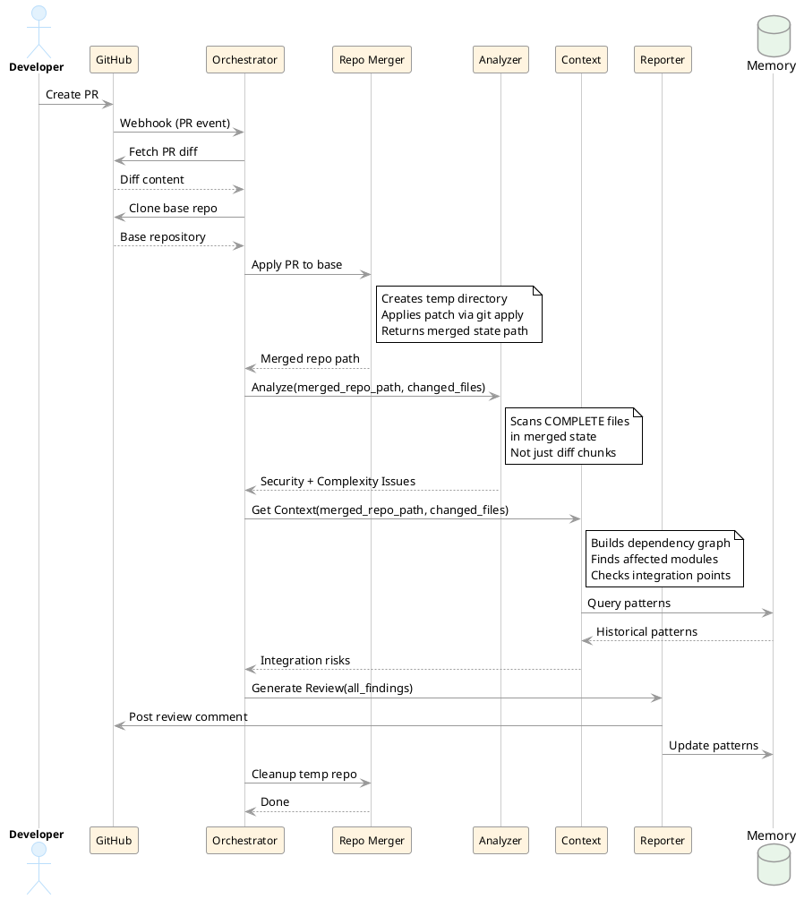

```plantuml
@startuml sequence-flow
!theme plain

skinparam sequence {
  ArrowColor #999999
  ActorBorderColor #BBDEFB
  ActorBackgroundColor #E3F2FD
  ActorFontName Arial
  ActorFontSize 12
  ActorFontStyle bold
  
  ParticipantBorderColor #999999
  ParticipantBackgroundColor #FFF4E0
  ParticipantFontName Arial
  ParticipantFontSize 12
  
  LifeLineBorderColor #CCCCCC
  LifeLineBackgroundColor #F5F5F5
  
  BoxBorderColor #999999
  BoxBackgroundColor #FAFAFA
}

skinparam database {
  BackgroundColor #E8F5E9
  BorderColor #999999
}

actor Developer as dev
participant "GitHub" as gh
participant "Orchestrator" as orch
participant "Repo Merger" as merger
participant "Analyzer" as ana
participant "Context" as ctx
participant "Reporter" as rep
database "Memory" as mem

dev -> gh : Create PR
gh -> orch : Webhook (PR event)

orch -> gh : Fetch PR diff
gh --> orch : Diff content

orch -> gh : Clone base repo
gh --> orch : Base repository

orch -> merger : Apply PR to base
note right of merger
  Creates temp directory
  Applies patch via git apply
  Returns merged state path
end note
merger --> orch : Merged repo path

orch -> ana : Analyze(merged_repo_path, changed_files)
note right of ana
  Scans COMPLETE files
  in merged state
  Not just diff chunks
end note
ana --> orch : Security + Complexity Issues

orch -> ctx : Get Context(merged_repo_path, changed_files)
note right of ctx
  Builds dependency graph
  Finds affected modules
  Checks integration points
end note

ctx -> mem : Query patterns
mem --> ctx : Historical patterns
ctx --> orch : Integration risks

orch -> rep : Generate Review(all_findings)
rep -> gh : Post review comment
rep -> mem : Update patterns

orch -> merger : Cleanup temp repo
merger --> orch : Done

@enduml
```
