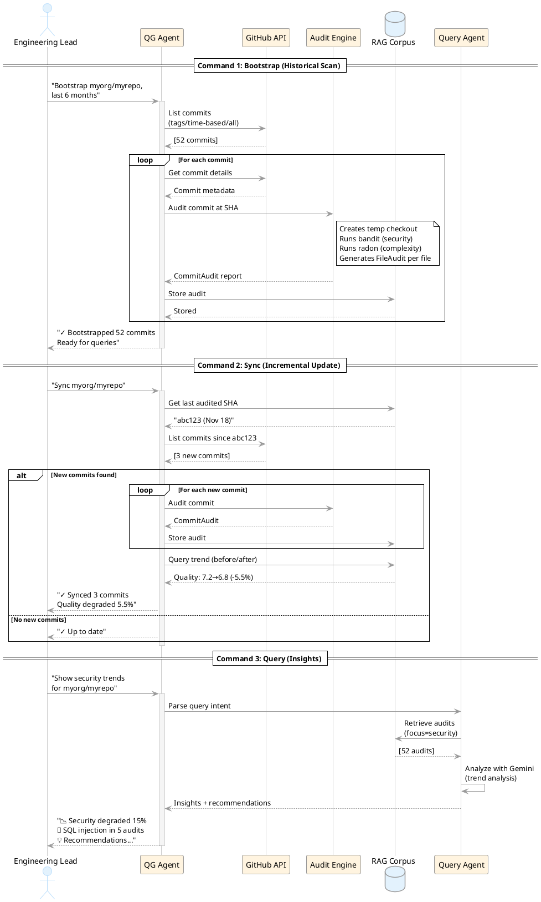

```plantuml
@startuml quality-guardian-flows
!theme plain

skinparam sequence {
  ArrowColor #999999
  ActorBorderColor #BBDEFB
  ActorBackgroundColor #E3F2FD
  ParticipantBorderColor #999999
  ParticipantBackgroundColor #FFF4E0
  LifeLineBorderColor #CCCCCC
  LifeLineBackgroundColor #F5F5F5
  BoxBorderColor #999999
  BoxBackgroundColor #FAFAFA
}

skinparam database {
  BackgroundColor #E3F2FD
  BorderColor #999999
}

actor "Engineering Lead" as user
participant "QG Agent" as agent
participant "GitHub API" as gh
participant "Audit Engine" as audit
database "RAG Corpus" as rag
participant "Query Agent" as query

== Command 1: Bootstrap (Historical Scan) ==

user -> agent : "Bootstrap myorg/myrepo,\nlast 6 months"
activate agent

agent -> gh : List commits\n(tags/time-based/all)
gh --> agent : [52 commits]

loop For each commit
  agent -> gh : Get commit details
  gh --> agent : Commit metadata
  
  agent -> audit : Audit commit at SHA
  note right of audit
    Creates temp checkout
    Runs bandit (security)
    Runs radon (complexity)
    Generates FileAudit per file
  end note
  audit --> agent : CommitAudit report
  
  agent -> rag : Store audit
  rag --> agent : Stored
end

agent --> user : "✓ Bootstrapped 52 commits\nReady for queries"
deactivate agent

== Command 2: Sync (Incremental Update) ==

user -> agent : "Sync myorg/myrepo"
activate agent

agent -> rag : Get last audited SHA
rag --> agent : "abc123 (Nov 18)"

agent -> gh : List commits since abc123
gh --> agent : [3 new commits]

alt New commits found
  loop For each new commit
    agent -> audit : Audit commit
    audit --> agent : CommitAudit
    agent -> rag : Store audit
  end
  
  agent -> rag : Query trend (before/after)
  rag --> agent : Quality: 7.2→6.8 (-5.5%)
  
  agent --> user : "✓ Synced 3 commits\nQuality degraded 5.5%"
else No new commits
  agent --> user : "✓ Up to date"
end

deactivate agent

== Command 3: Query (Insights) ==

user -> agent : "Show security trends\nfor myorg/myrepo"
activate agent

agent -> query : Parse query intent
query -> rag : Retrieve audits\n(focus=security)
rag --> query : [52 audits]

query -> query : Analyze with Gemini\n(trend analysis)
query --> agent : Insights + recommendations

agent --> user : "📉 Security degraded 15%\n🔴 SQL injection in 5 audits\n💡 Recommendations..."
deactivate agent

@enduml
```
